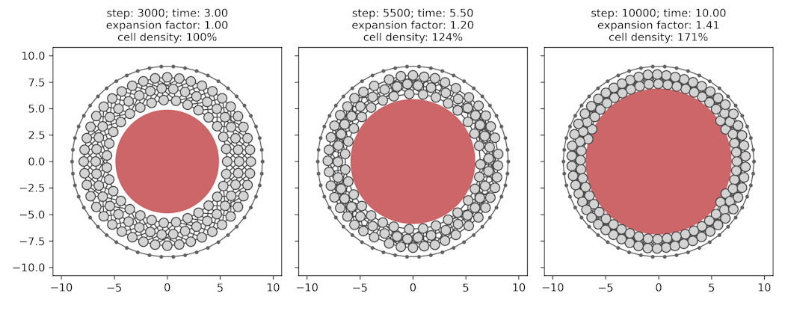

# cavity-expansion-model

This repo hosts the code for the simple illustrative particle-based 2D model of cavity expansion and its effect on cell density for the paper "Hydrostatic pressure regulates competence for neural crest induction" by Alasaadi & colleagues. All code was written by Jonas Hartmann.

### How it works

At each time step (`simple_cell_sim.simulation.timestep`), the pairwise distances between all cells are computed and converted into forces affecting each cell based on an anharmonic potential function. Cells thus strongly repulse each other at very short distances (resistance to compression), weakly attract each other at medium distances (adhesion), and do not affect each other at long distances. The positions of cells are then updated based on the summed contributions of all pairwise forces (and a small amount of Gaussian noise), scaled by the size of the time step (`delta_t`). The model is initialized as a circular band of uniformly spaced cells, with the outer-most ring of cells being fixed in place to represent the stiff vitelline membrane around the embryo. The cavity is modeled as a single large cell at the center that only imposes repulsive forces and whose resting size is increased over time to reflect growth of the cavity.

### Repo structure and usage

- `simple_cell_sim/simulation.py`: functions for the simulation engine; the main one is `timestep`, which:
    - Retrieves pairwise distances between cells
    - Computes the resulting forces for all provided force terms
    - Adds a small amount of Gaussian noise
    - Sums up the force contributions
    - Updates the cell positions
- `simple_cell_sim/potential_funcs.py`: functions relating distances between cells to potential energies
    - Only used for illustrative purposes in the current implementation
- `simple_cell_sim/force_funcs.py`: functions relating distances between cells to forces
    - The ones used in the cavity model are `f_anharmonic` (for cells) and `f_Hooke` (for the cavity)
- `Notebooks/MODEL - Cavity Expansion.ipynb`: jupyter notebook containing the cavity expansion model
    - Sets up the initial conditions and parameters
    - Runs the simulation
    - Produces figures & movie.
    - **_To reproduce what is shown in the paper, simply install python and the required dependencies (see below) and run this notebook._**

### Dependencies

- Python `3.9.7` and jupyter notebook (I used and recommend using the [Anaconda distribution](https://www.anaconda.com/download))
- Scientific python packages
    - `numpy==1.21.5`
    - `matplotlib==3.5.3`

### Contact and support

- The study's lead author is Roberto Mayor (University College London). Please contact him for any queries about the paper.
- For code-specific question, you may contact Jonas Hartmann (University College London) or open an issue on GitHub.
    - Note that I cannot promise support for any use cases other than direct reproduction of the study's results.